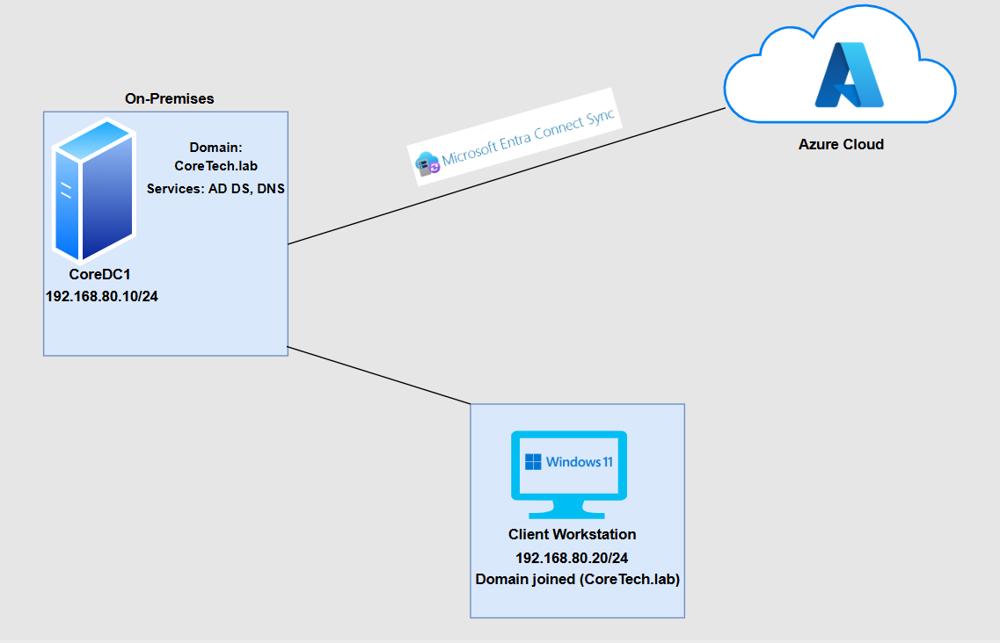
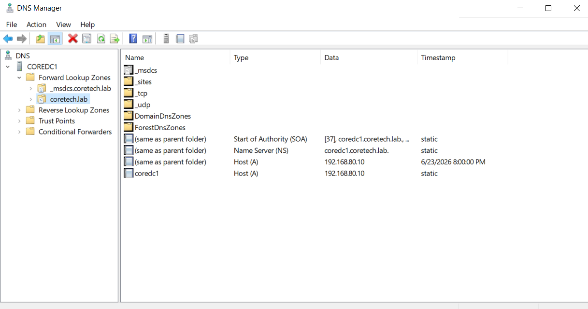
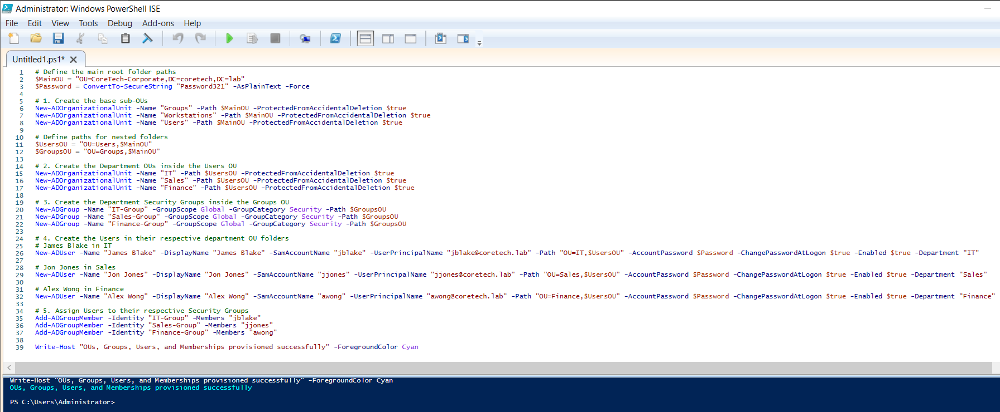
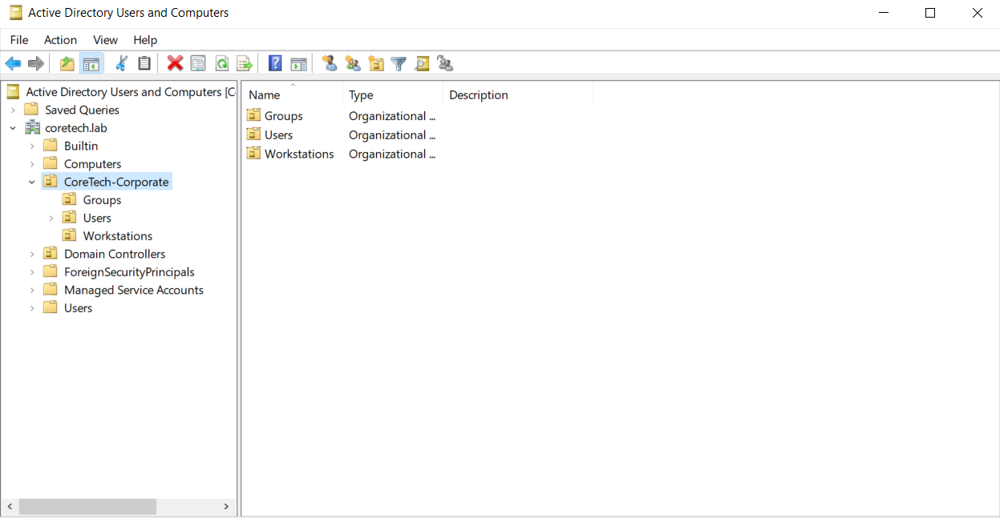
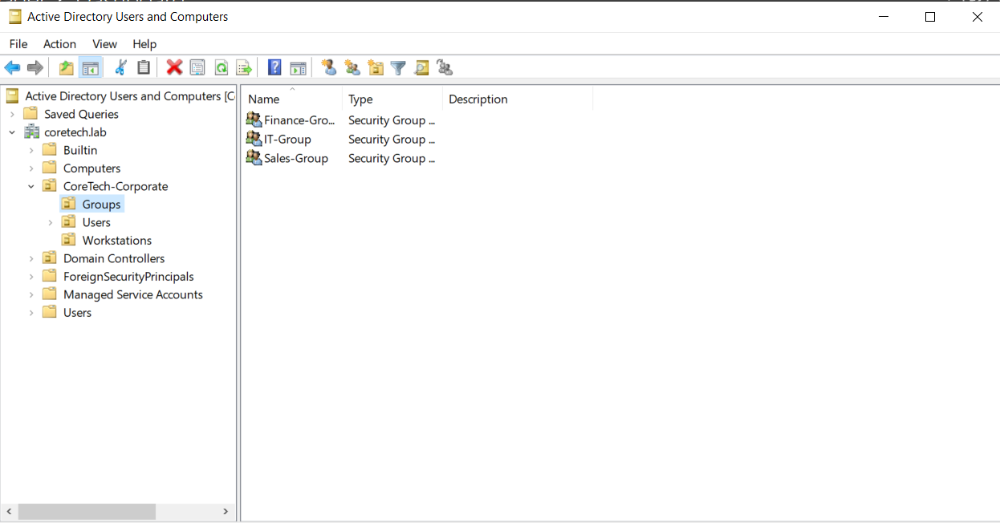
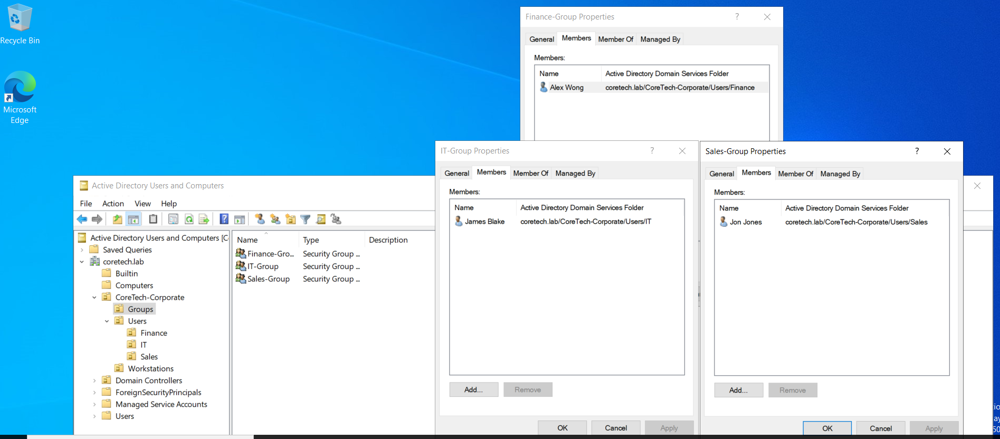
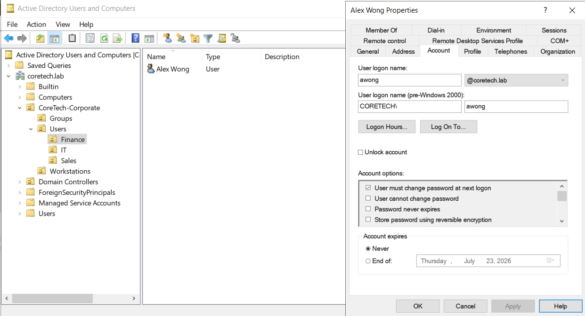
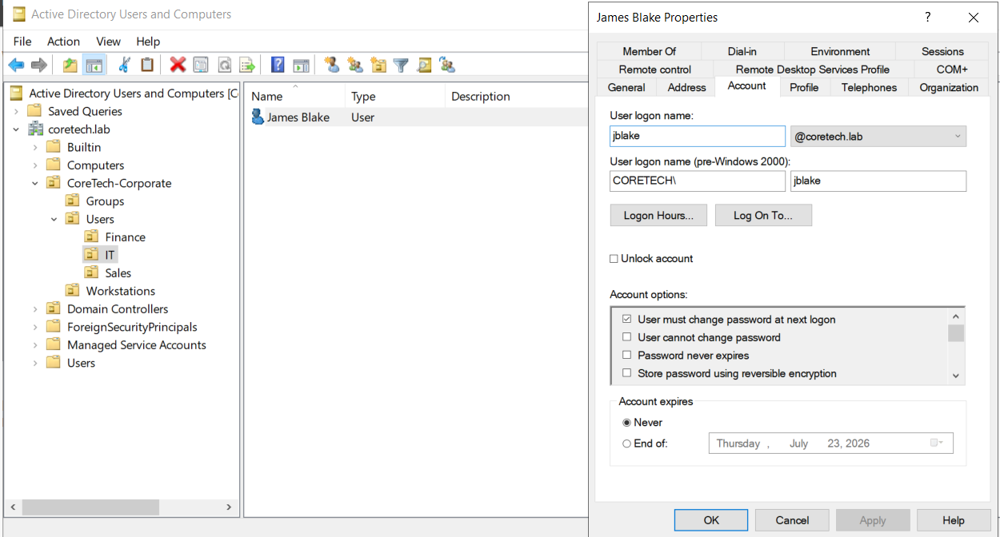
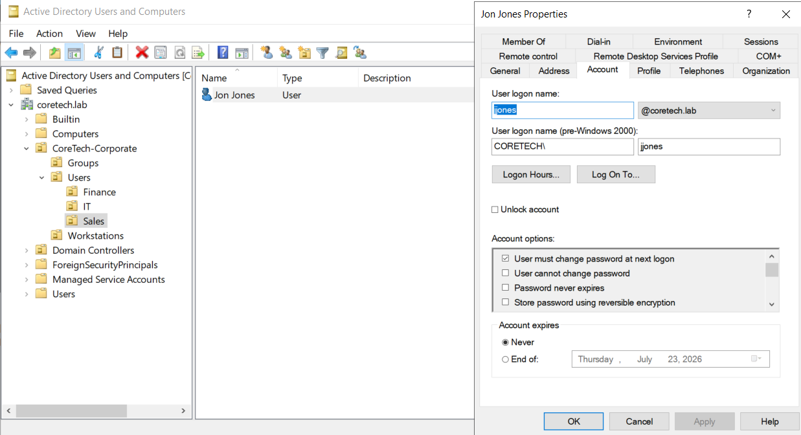

# 🌐Hybrid AD & Entra ID Deployment


## Project Overview
This project demonstrates the setup and management of a hybrid IT environment that combines on-premises infrastructure with cloud services. It focuses on identity and access management, including user account provisioning, group management, authentication, and endpoint administration. The goal is to build and maintain a secure and scalable environment that reflects how many modern small-to-medium businesses manage users, devices, and resources across both on-premises and cloud platforms.

---


## Network Diagram


---


## Technologies Used
* **Hypervisor:** VMware Workstation Pro (Configured with isolated NAT networking)
* **Operating Systems:** Windows Server 2022 (Standard Evaluation), Windows 11 Pro
* **Directory & Identity Services:** Active Directory Domain Services (AD DS), Microsoft Entra ID (Azure AD)
* **Identity Synchronization:** Microsoft Entra Connect
* **Network Services:** DNS (Domain Name System)
* **Administration & Automation:** Windows PowerShell, Group Policy Management, Active Directory Users and Computers (ADUC)

---
### DNS Console displaying forward lookup zone and addressing for CoreDC1


---

## Automated User and Infrastructure Management
To simulate a scalable corporate environment and avoid inefficient manual data entry, a custom **PowerShell script** was executed on the Domain Controller (CoreDC1). This script built the complete nested Organizational Unit (OU) hierarchy and bulk-provisioned department-specific user accounts with standard corporate attributes.

### 1. Hierarchy Strategy
The hierarchy is structured to separate administrative controls cleanly. The root container **CoreTech-Corporate** isolates lab assets from default Windows service objects, splitting them into:
* **Groups**: Dedicated for group scoping.
* **Workstations**: Enclosure for corporate endpoint placement.
* **Users**: Nested departmental OUs (**IT**, **Sales**, **Finance**) managing targeted employee access profiles.

### 2. The Configuration Script
The following automated configuration script was executed via PowerShell ISE with Administrative privileges:

```powershell
# Define the main root folder paths
$MainOU = "OU=CoreTech-Corporate,DC=coretech,DC=lab"
$Password = ConvertTo-SecureString "Password321" -AsPlainText -Force

# 1. Create the base sub-OUs
New-ADOrganizationalUnit -Name "Groups" -Path $MainOU -ProtectedFromAccidentalDeletion $true
New-ADOrganizationalUnit -Name "Workstations" -Path $MainOU -ProtectedFromAccidentalDeletion $true
New-ADOrganizationalUnit -Name "Users" -Path $MainOU -ProtectedFromAccidentalDeletion $true

# Define paths for nested folders
$UsersOU = "OU=Users,$MainOU"
$GroupsOU = "OU=Groups,$MainOU"

# 2. Create the Department OUs inside the Users OU
New-ADOrganizationalUnit -Name "IT" -Path $UsersOU -ProtectedFromAccidentalDeletion $true
New-ADOrganizationalUnit -Name "Sales" -Path $UsersOU -ProtectedFromAccidentalDeletion $true
New-ADOrganizationalUnit -Name "Finance" -Path $UsersOU -ProtectedFromAccidentalDeletion $true

# 3. Create the Department Security Groups inside the Groups OU
New-ADGroup -Name "IT-Group" -GroupScope Global -GroupCategory Security -Path $GroupsOU
New-ADGroup -Name "Sales-Group" -GroupScope Global -GroupCategory Security -Path $GroupsOU
New-ADGroup -Name "Finance-Group" -GroupScope Global -GroupCategory Security -Path $GroupsOU

# 4. Create the Users in their respective department OU folders
# James Blake in IT
New-ADUser -Name "James Blake" -DisplayName "James Blake" -SamAccountName "jblake" -UserPrincipalName "jblake@coretech.lab" -Path "OU=IT,$UsersOU" -AccountPassword $Password -ChangePasswordAtLogon $true -Enabled $true -Department "IT"

# Jon Jones in Sales
New-ADUser -Name "Jon Jones" -DisplayName "Jon Jones" -SamAccountName "jjones" -UserPrincipalName "jjones@coretech.lab" -Path "OU=Sales,$UsersOU" -AccountPassword $Password -ChangePasswordAtLogon $true -Enabled $true -Department "Sales"

# Alex Wong in Finance
New-ADUser -Name "Alex Wong" -DisplayName "Alex Wong" -SamAccountName "awong" -UserPrincipalName "awong@coretech.lab" -Path "OU=Finance,$UsersOU" -AccountPassword $Password -ChangePasswordAtLogon $true -Enabled $true -Department "Finance"

# 5. Assign Users to their respective Security Groups
Add-ADGroupMember -Identity "IT-Group" -Members "jblake"
Add-ADGroupMember -Identity "Sales-Group" -Members "jjones"
Add-ADGroupMember -Identity "Finance-Group" -Members "awong"

Write-Host "OUs, Groups, Users, and Memberships provisioned successfully" -ForegroundColor Cyan
```

### 3. Configuration Results
Upon execution, the script successfully completed the following results:
* **Directory Structure Created:** The top-level `CoreTech-Corporate` OU was populated with three distinct OUs: `Groups`, `Workstations`, and `Users`.
* **Departmental Separation:** Inside the `Users` OU, sub-OUs for `IT`, `Sales`, and `Finance` were successfully built.
* **Security Groups Provisioned:** Three core Global Security groups (`IT-Group`, `Sales-Group`, and `Finance-Group`) were created under the `Groups` OU.
* **Automated User Provisioning:** The script automatically created the three initial corporate users, completely filled out their required attributes, and added each user into their respective security group.

#

**Powershell Script executed:**


#

**All 3 required OUs populated under the top-level corporate OU:**


#

**All 3 required groups populated under the top-level corporate OU:**


**Group Memberships:**


#

### Employees are provisioned into their respective department OUs under the central Users OU:

**Alex Wong - Finance:**


#

**James Blake - IT:**


#

**Jon Jones - Sales:**



